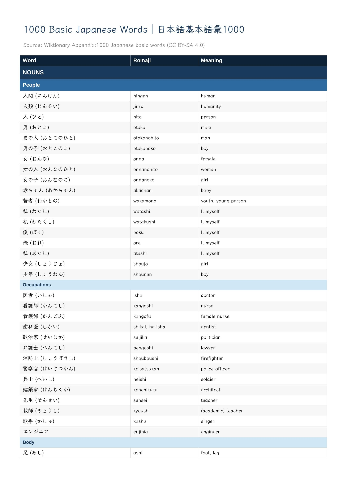

# Japanese Practice

[](LICENSE)
[](https://creativecommons.org/licenses/by-sa/3.0/)

Generate printable flash cards, handwriting practice sheets, reference charts, and stroke order guides for all hiragana and katakana characters. Also includes a web-based vocabulary builder for creating custom JLPT vocabulary PDFs.

> **Educational use only.** All materials are intended for personal study and practice. Vocabulary data is sourced from community-maintained dictionaries and may contain errors or omissions. Always verify with authoritative references when accuracy matters.

Produces five types of PDF:
- **Flash cards** — 214 double-sided cards (107 hiragana + 107 katakana) arranged in a 3×3 grid on A4 pages, designed for duplex printing and cutting.
- **Practice sheets** — Landscape A4 pages with 2cm grid boxes. Each character gets 3 rows: the first box shows the KanjiVG stroke-order character, the rest are empty for handwriting practice. Boxes include dashed cross guides for centering.
- **Reference charts** — Landscape A4 pages with the standard gojūon table layout: basic characters, dakuten/handakuten, and yōon combinations with romaji labels.
- **Stroke order** — Portrait A4 pages with KanjiVG stroke diagrams and numbered indicators for each character, split into basic, dakuten, and combination sections for readability.
- **Vocabulary reference** — Per-JLPT-level (N5–N1) vocabulary PDFs in English and Swedish, sourced from JMdict. Each level contains all words for that level with meanings, POS, register tags, and antonyms.

## Quick Start

```bash
pip install -r requirements.txt
python generate.py --setup      # verify prerequisites
python generate.py --kana       # generate flash cards → output/kana_flashcards.pdf
```

Requires Python 3.10+ and [ReportLab](https://www.reportlab.com/). The Klee One font is bundled.

## Downloads

Download the latest pre-built PDFs:

- [Flash cards 55×82mm](https://github.com/featurequest/practice-japanese/releases/latest/download/flashcards-55x82.pdf)
- [Flash cards 63×88mm](https://github.com/featurequest/practice-japanese/releases/latest/download/flashcards-63x88.pdf)
- [Flash cards 74×105mm](https://github.com/featurequest/practice-japanese/releases/latest/download/flashcards-74x105.pdf)
- [Practice sheets — Hiragana](https://github.com/featurequest/practice-japanese/releases/latest/download/practice-hiragana.pdf)
- [Practice sheets — Katakana](https://github.com/featurequest/practice-japanese/releases/latest/download/practice-katakana.pdf)
- [Reference chart](https://github.com/featurequest/practice-japanese/releases/latest/download/chart.pdf)
- [Reference chart — Hiragana](https://github.com/featurequest/practice-japanese/releases/latest/download/chart-hiragana.pdf)
- [Reference chart — Katakana](https://github.com/featurequest/practice-japanese/releases/latest/download/chart-katakana.pdf)
- [Stroke order](https://github.com/featurequest/practice-japanese/releases/latest/download/stroke-order.pdf)
- [Stroke order — Hiragana](https://github.com/featurequest/practice-japanese/releases/latest/download/stroke-order-hiragana.pdf)
- [Stroke order — Katakana](https://github.com/featurequest/practice-japanese/releases/latest/download/stroke-order-katakana.pdf)
- [Vocabulary N5 (EN)](https://github.com/featurequest/practice-japanese/releases/latest/download/vocabulary_n5.pdf)
- [Vocabulary N5 (SV)](https://github.com/featurequest/practice-japanese/releases/latest/download/vocabulary_sv_n5.pdf)
- [Vocabulary N4 (EN)](https://github.com/featurequest/practice-japanese/releases/latest/download/vocabulary_n4.pdf)
- [Vocabulary N4 (SV)](https://github.com/featurequest/practice-japanese/releases/latest/download/vocabulary_sv_n4.pdf)
- [Vocabulary N3 (EN)](https://github.com/featurequest/practice-japanese/releases/latest/download/vocabulary_n3.pdf)
- [Vocabulary N3 (SV)](https://github.com/featurequest/practice-japanese/releases/latest/download/vocabulary_sv_n3.pdf)
- [Vocabulary N2 (EN)](https://github.com/featurequest/practice-japanese/releases/latest/download/vocabulary_n2.pdf)
- [Vocabulary N2 (SV)](https://github.com/featurequest/practice-japanese/releases/latest/download/vocabulary_sv_n2.pdf)
- [Vocabulary N1 (EN)](https://github.com/featurequest/practice-japanese/releases/latest/download/vocabulary_n1.pdf)
- [Vocabulary N1 (SV)](https://github.com/featurequest/practice-japanese/releases/latest/download/vocabulary_sv_n1.pdf)

### Reading practice

- [Momotarō](https://github.com/featurequest/practice-japanese/releases/latest/download/story_momotaro.pdf)
- [Urashima Tarō](https://github.com/featurequest/practice-japanese/releases/latest/download/story_urashima.pdf)
- [Kaguya-hime](https://github.com/featurequest/practice-japanese/releases/latest/download/story_kaguya.pdf)
- [Tsuru no Ongaeshi](https://github.com/featurequest/practice-japanese/releases/latest/download/story_tsuru.pdf)
- [Issun Bōshi](https://github.com/featurequest/practice-japanese/releases/latest/download/story_issunboshi.pdf)

## Web App — Vocabulary Builder

The site at [featurequest.github.io/practice-japanese](https://featurequest.github.io/practice-japanese/) includes an interactive vocabulary builder. Search 7,500+ JLPT words (N5–N1), select the ones you want, and download a custom vocabulary PDF — client-side, no server required.

### Running locally

```bash
cd web-src
npm install
npm run dev        # starts Vite dev server at http://localhost:5173
```

`npm run dev` uses the pre-built `public/vocab.json`. If `data/vocabulary.json` has been updated and you want the web app to reflect the latest data, regenerate it first:

```bash
cd web-src
node scripts/build-vocab-data.js   # reads ../../data/vocabulary.json, writes public/vocab.json
```

`npm run build` runs this script automatically as a `prebuild` step before compiling the site.

### Running tests

```bash
cd web-src
npm test
```

## Examples

**Flash cards — front (character) and back (romaji + stroke order):**

<p float="left">
  
  
</p>

**Practice sheet:**


**Reference chart:**


**Stroke order:**


**Vocabulary reference:**



## Coverage

Each script includes:
- 46 basic gojūon (あ→ん / ア→ン)
- 20 dakuten variants (が, ざ, だ, ば / ガ, ザ, ダ, バ)
- 5 handakuten variants (ぱ行 / パ行)
- 33 yōon combinations (きゃ, しゅ, ちょ, etc.)

## Card Layout

| Front | Back |
|-------|------|
| Large kana character | Romaji reading |
| Type label (hiragana/katakana) | Stroke order diagram |

Cards are 55×82mm (roughly A7), printed 9 per A4 sheet with cut lines.

## Usage

All commands go through `python generate.py`. Run without arguments to see help.

### Kana

```bash
python generate.py --kana                              # Flash cards (214 cards)
python generate.py --kana --hiragana-only              # Hiragana only
python generate.py --kana --katakana-only              # Katakana only
python generate.py --kana -o my_cards.pdf              # Custom output path

python generate.py --kana --practice                   # Practice sheets
python generate.py --kana --practice --hiragana-only

python generate.py --kana --chart                      # Reference chart
python generate.py --kana --chart --hiragana-only

python generate.py --kana --stroke-order               # Stroke order guide
python generate.py --kana --stroke-order --hiragana-only

python generate.py --kana --card-width 63 --card-height 88   # Custom card size (mm)
```

### Vocabulary

```bash
python generate.py --vocabulary --jlpt n5              # N5 English  → output/vocabulary_n5.pdf
python generate.py --vocabulary --jlpt n5 --lang sv    # N5 Swedish  → output/vocabulary_sv_n5.pdf
python generate.py --vocabulary --jlpt n3              # N3 English  → output/vocabulary_n3.pdf
python generate.py --anki --jlpt n5                    # N5 Anki deck  → output/anki_n5.apkg
python generate.py --anki                              # All levels     → output/anki_n5.apkg … anki_n1.apkg + anki_all.apkg
```

### Stories

```bash
# Generate story PDFs
python generate.py --stories                           # All folk tales → output/story_*.pdf
```

### Maintenance

```bash
python generate.py --setup                             # Check prerequisites; auto-build vocabulary data if missing
python generate.py --build-vocabulary                  # Force rebuild data/vocabulary.json (~50MB download)
```

### Developer

```bash
python generate.py --update-strokes     # Re-download KanjiVG and regenerate stroke data
python generate.py --generate-examples  # Regenerate example images in docs/ (requires poppler-utils)
```

## Printing

1. Print the PDF double-sided with **long-edge flip**
2. Cut along the gray grid lines
3. Each card's front (character) aligns with its back (romaji + strokes)

Adjust `BACK_PAGE_OFFSET_Y` in `config.py` if your printer's duplex alignment is off.

## Configuration

All tunables are in `config.py`. Values use ReportLab's `mm` unit.

| Variable | Default | Description |
|----------|---------|-------------|
| `CARD_WIDTH` | 55mm | Card width (also settable via `--card-width`) |
| `CARD_HEIGHT` | 82mm | Card height (also settable via `--card-height`) |
| `BACK_PAGE_OFFSET_Y` | -2.0mm | Vertical shift for back page content to compensate for duplex misalignment. Positive = up, negative = down |
| `KANA_FONT_SIZE` | 34mm | Large character size on card front |
| `ROMAJI_FONT_SIZE` | 8mm | Romaji text size on card back |
| `LABEL_FONT_SIZE` | 3mm | "hiragana"/"katakana" label size on card front |
| `STROKE_LINE_WIDTH` | 0.8mm | Stroke diagram line thickness |
| `STROKE_DOT_RADIUS` | 1.0mm | Stroke start-point dot size |
| `STROKE_COLORS` | list of 6 RGB tuples | Per-stroke colors cycling indigo→emerald→red→amber→violet→cyan |
| `CUT_LINE_WIDTH` | 0.2mm | Cut guide line thickness |
| `CUT_LINE_COLOR` | (0.7, 0.7, 0.7) | Cut guide line color (light gray) |

Grid layout (`COLS`, `ROWS`, `MARGIN_X`, `MARGIN_Y`) is auto-computed from the card and page sizes so cards are always centered on A4.

## Licenses and Attribution

### Stroke Data — KanjiVG

Stroke order data derived from [KanjiVG](https://kanjivg.tagaini.net/) by Ulrich Apel, licensed under [Creative Commons Attribution-ShareAlike 3.0](https://creativecommons.org/licenses/by-sa/3.0/).

Adaptations: SVG stroke paths extracted, dakuten/handakuten/yōon variants composed from base characters for flash card and practice sheet rendering.

### Vocabulary Data

`data/vocabulary.json` is built from two sources:

**JLPT word lists** by Jonathan Waller (https://www.tanos.co.uk/jlpt/), used with permission. Lists cover N5–N1 vocabulary.

**JMdict** by the Electronic Dictionary Research and Development Group (https://www.edrdg.org/), licensed under [Creative Commons Attribution-ShareAlike 3.0](https://creativecommons.org/licenses/by-sa/3.0/). Provides multilingual meanings, part of speech, register tags, and antonyms.

### Fonts

- **[Klee One SemiBold](https://github.com/fontworks-fonts/Klee)** by Fontworks — used for all Japanese text and labels. Licensed under the [SIL Open Font License 1.1](fonts/OFL-KleeOne.txt).

### Python Dependencies

| Package | License | Use |
|---------|---------|-----|
| [ReportLab](https://www.reportlab.com/) | BSD | PDF generation |
| [pykakasi](https://github.com/miurahr/pykakasi) | GPL-3.0-or-later | Romaji generation (build-time only) |
| [genanki](https://github.com/kerrickstaley/genanki) | MIT | Anki deck export |
