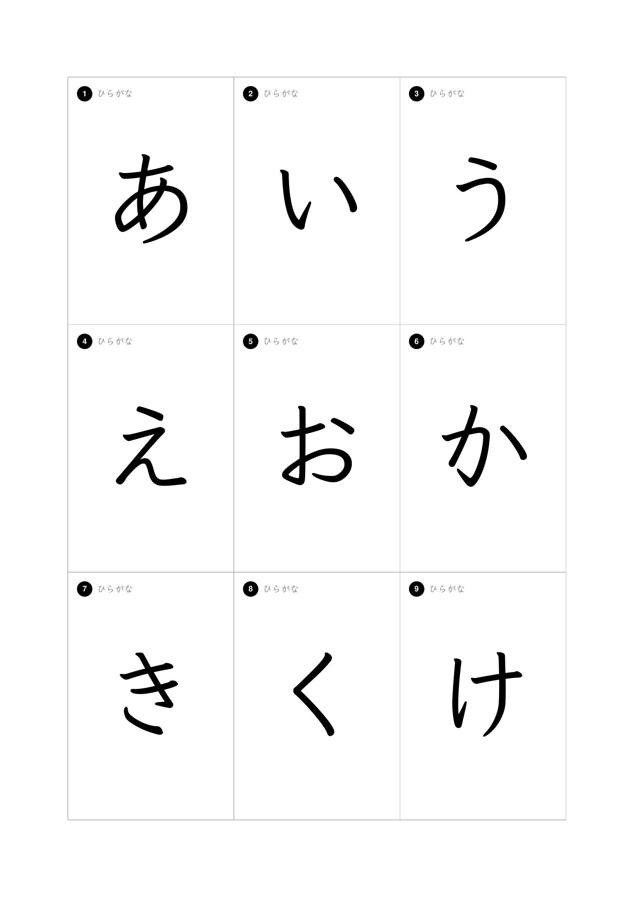
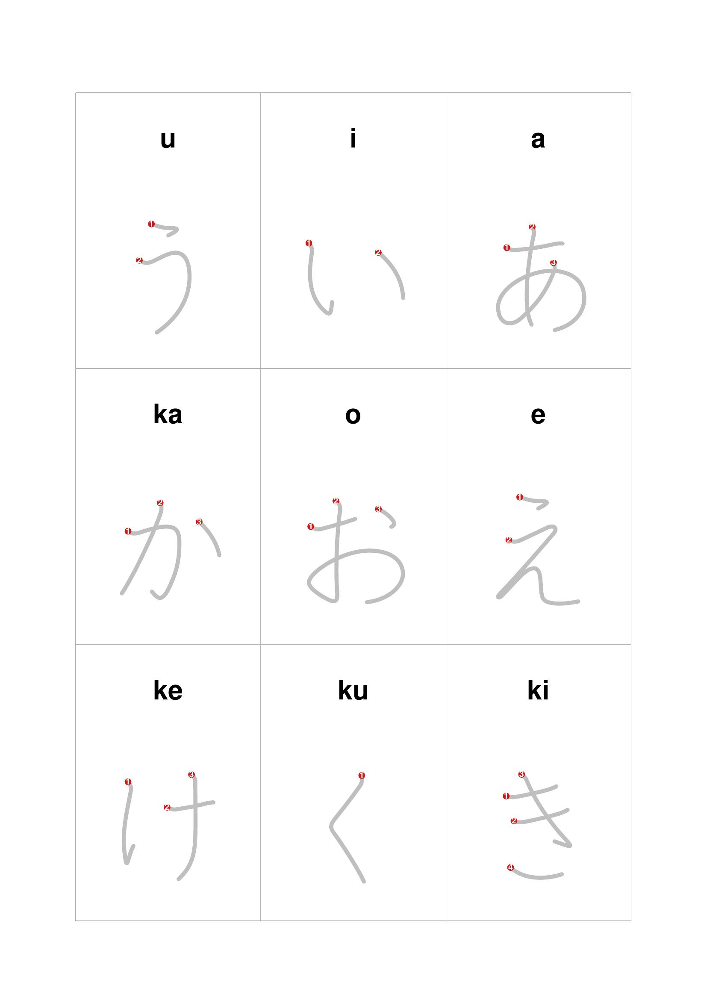
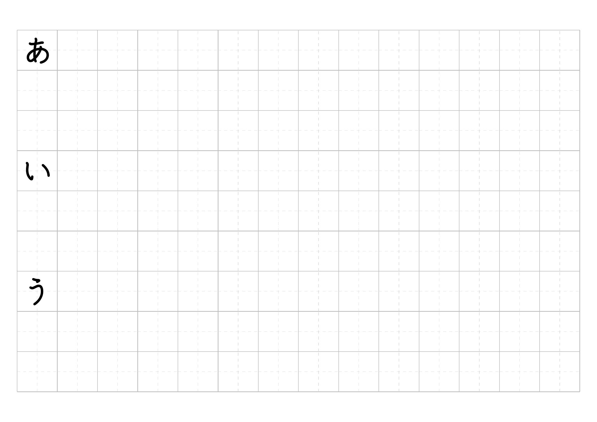
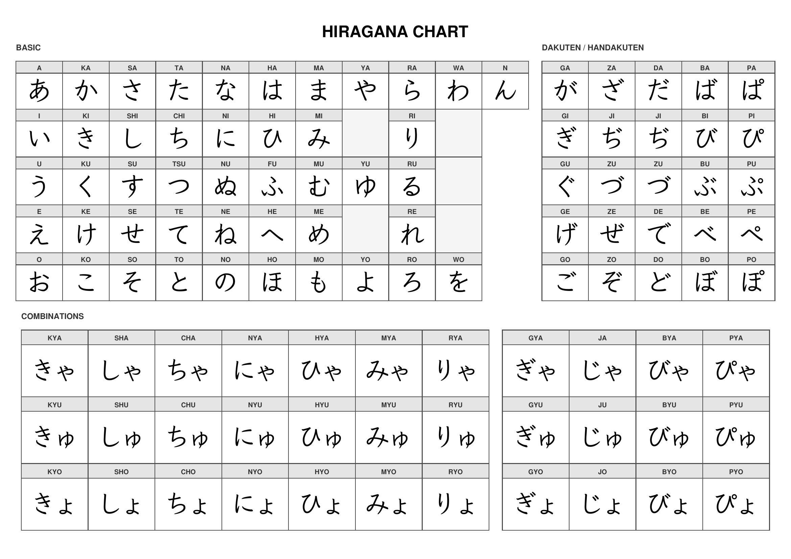
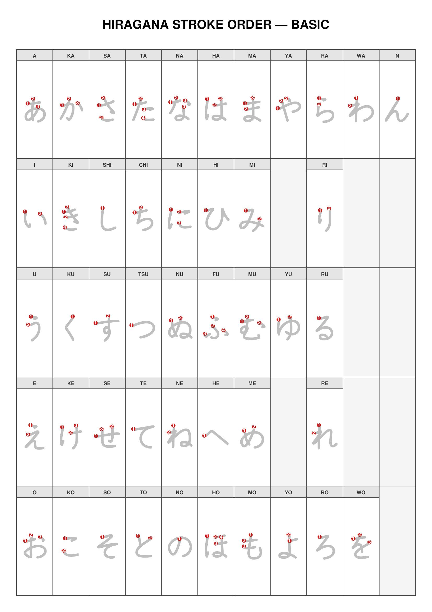

# Japanese Kana Practice

Generate printable flash cards, handwriting practice sheets, reference charts, and stroke order guides for all hiragana and katakana characters.

Produces four types of PDF:
- **Flash cards** — 208 double-sided cards (104 hiragana + 104 katakana) arranged in a 3×3 grid on A4 pages, designed for duplex printing and cutting.
- **Practice sheets** — Landscape A4 pages with 2cm grid boxes. Each character gets 3 rows: the first box shows the KanjiVG stroke-order character, the rest are empty for handwriting practice. Boxes include dashed cross guides for centering.
- **Reference charts** — Landscape A4 pages with the standard gojūon table layout: basic characters, dakuten/handakuten, and yōon combinations with romaji labels.
- **Stroke order** — Portrait A4 pages with KanjiVG stroke diagrams and numbered indicators for each character, split into basic, dakuten, and combination sections for readability.

## Downloads

Download the latest pre-built PDFs:

- [Flash cards 55×82mm](https://github.com/featurequest/practice-japanese/releases/latest/download/flashcards-55x82.pdf)
- [Flash cards 63×88mm](https://github.com/featurequest/practice-japanese/releases/latest/download/flashcards-63x88.pdf)
- [Flash cards 74×105mm](https://github.com/featurequest/practice-japanese/releases/latest/download/flashcards-74x105.pdf)
- [Practice sheets — Hiragana](https://github.com/featurequest/practice-japanese/releases/latest/download/practice-hiragana.pdf)
- [Practice sheets — Katakana](https://github.com/featurequest/practice-japanese/releases/latest/download/practice-katakana.pdf)
- [Reference chart](https://github.com/featurequest/practice-japanese/releases/latest/download/chart.pdf)
- [Reference chart — Hiragana](https://github.com/featurequest/practice-japanese/releases/latest/download/chart-hiragana.pdf)
- [Reference chart — Katakana](https://github.com/featurequest/practice-japanese/releases/latest/download/chart-katakana.pdf)
- [Stroke order](https://github.com/featurequest/practice-japanese/releases/latest/download/stroke-order.pdf)
- [Stroke order — Hiragana](https://github.com/featurequest/practice-japanese/releases/latest/download/stroke-order-hiragana.pdf)
- [Stroke order — Katakana](https://github.com/featurequest/practice-japanese/releases/latest/download/stroke-order-katakana.pdf)

## Examples

**Flash cards — front (character) and back (romaji + stroke order):**

<p float="left">
  
  
</p>

**Practice sheet:**



**Reference chart:**



**Stroke order:**



## Coverage

Each script includes:
- 46 basic gojūon (あ→ん / ア→ン)
- 20 dakuten variants (が, ざ, だ, ば / ガ, ザ, ダ, バ)
- 5 handakuten variants (ぱ行 / パ行)
- 33 yōon combinations (きゃ, しゅ, ちょ, etc.)

## Card Layout

| Front | Back |
|-------|------|
| Large kana character | Romaji reading |
| Type label (hiragana/katakana) | Stroke order diagram |

Cards are 55×82mm (roughly A7), printed 9 per A4 sheet with cut lines.

## Setup

```bash
pip install -r requirements.txt
```

Requires Python 3.10+ and [ReportLab](https://www.reportlab.com/). The Klee One font is bundled in the repository.

## Usage

```bash
# Flash cards
python generate.py                     # Full deck (208 cards)
python generate.py --hiragana-only     # Hiragana only
python generate.py --katakana-only     # Katakana only
python generate.py -o my_cards.pdf     # Custom output path

# Practice sheets
python generate.py --practice                    # Full set
python generate.py --practice --hiragana-only    # Hiragana only
python generate.py --practice --katakana-only    # Katakana only

# Reference charts (landscape A4, gojūon table layout)
python generate.py --chart                       # Both scripts
python generate.py --chart --hiragana-only       # Hiragana only
python generate.py --chart --katakana-only       # Katakana only

# Stroke order (portrait A4, KanjiVG diagrams with numbered strokes)
python generate.py --stroke-order                       # Both scripts
python generate.py --stroke-order --hiragana-only       # Hiragana only
python generate.py --stroke-order --katakana-only       # Katakana only

# Custom card size (in mm, default: 55×82)
python generate.py --card-width 60 --card-height 90

# Maintenance
python generate.py --update-strokes      # Re-download KanjiVG and regenerate stroke data
python generate.py --generate-examples   # Regenerate example images in docs/
```

Default output paths: `output/kana_flashcards.pdf`, `output/kana_practice.pdf`, `output/kana_chart.pdf`, `output/kana_stroke_order.pdf`.

## Printing

1. Print the PDF double-sided with **long-edge flip**
2. Cut along the gray grid lines
3. Each card's front (character) aligns with its back (romaji + strokes)

Adjust `BACK_PAGE_OFFSET_Y` in `config.py` if your printer's duplex alignment is off.

## Configuration

All tunables are in `config.py`. Values use ReportLab's `mm` unit.

| Variable | Default | Description |
|----------|---------|-------------|
| `CARD_WIDTH` | 55mm | Card width (also settable via `--card-width`) |
| `CARD_HEIGHT` | 82mm | Card height (also settable via `--card-height`) |
| `BACK_PAGE_OFFSET_Y` | -2.0mm | Vertical shift for back page content to compensate for duplex misalignment. Positive = up, negative = down |
| `KANA_FONT_SIZE` | 34mm | Large character size on card front |
| `ROMAJI_FONT_SIZE` | 8mm | Romaji text size on card back |
| `LABEL_FONT_SIZE` | 3mm | "hiragana"/"katakana" label size on card front |
| `STROKE_LINE_WIDTH` | 0.8mm | Stroke diagram line thickness |
| `STROKE_DOT_RADIUS` | 1.0mm | Stroke start-point dot size |
| `STROKE_COLOR` | (0.2, 0.2, 0.2) | Stroke line color (dark gray) |
| `STROKE_NUMBER_COLOR` | (0.8, 0.1, 0.1) | Stroke number color (red) |
| `CUT_LINE_WIDTH` | 0.2mm | Cut guide line thickness |
| `CUT_LINE_COLOR` | (0.7, 0.7, 0.7) | Cut guide line color (light gray) |

Grid layout (`COLS`, `ROWS`, `MARGIN_X`, `MARGIN_Y`) is auto-computed from the card and page sizes so cards are always centered on A4.

## Licenses and Attribution

### Stroke Data — KanjiVG

Stroke order data derived from [KanjiVG](https://kanjivg.tagaini.net/) by Ulrich Apel, licensed under [Creative Commons Attribution-ShareAlike 3.0](https://creativecommons.org/licenses/by-sa/3.0/).

Adaptations: SVG stroke paths extracted, dakuten/handakuten/yōon variants composed from base characters for flash card and practice sheet rendering.

### Fonts

- **[Klee One SemiBold](https://github.com/fontworks-fonts/Klee)** by Fontworks — used for all Japanese text and labels. Licensed under the [SIL Open Font License 1.1](fonts/OFL-KleeOne.txt).
